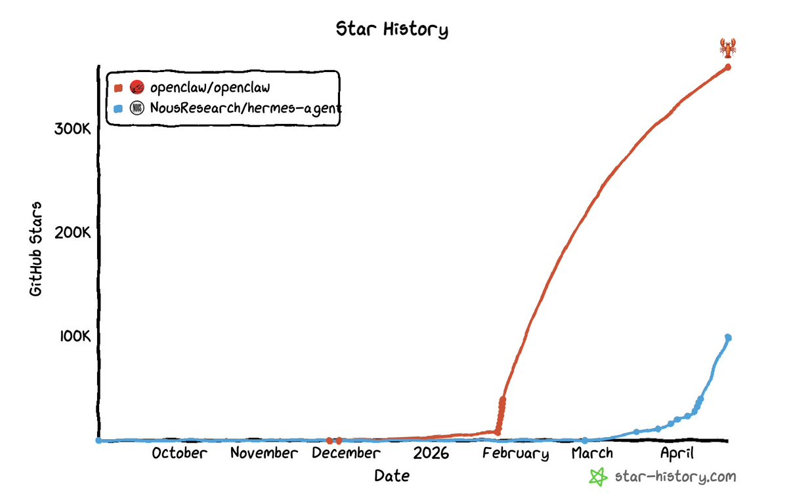
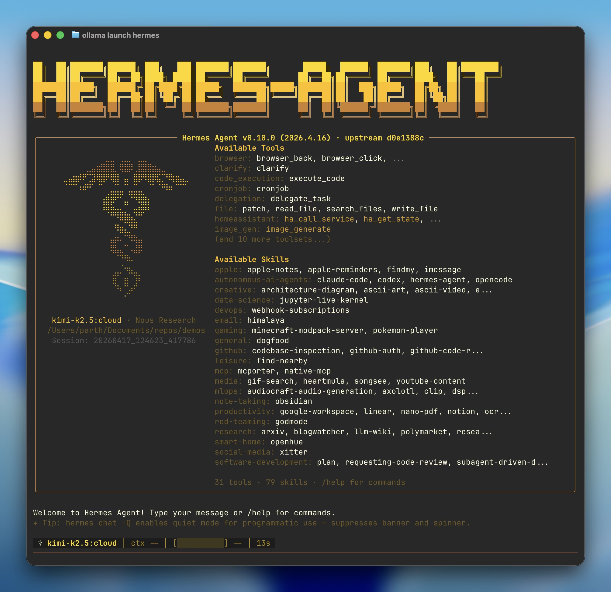
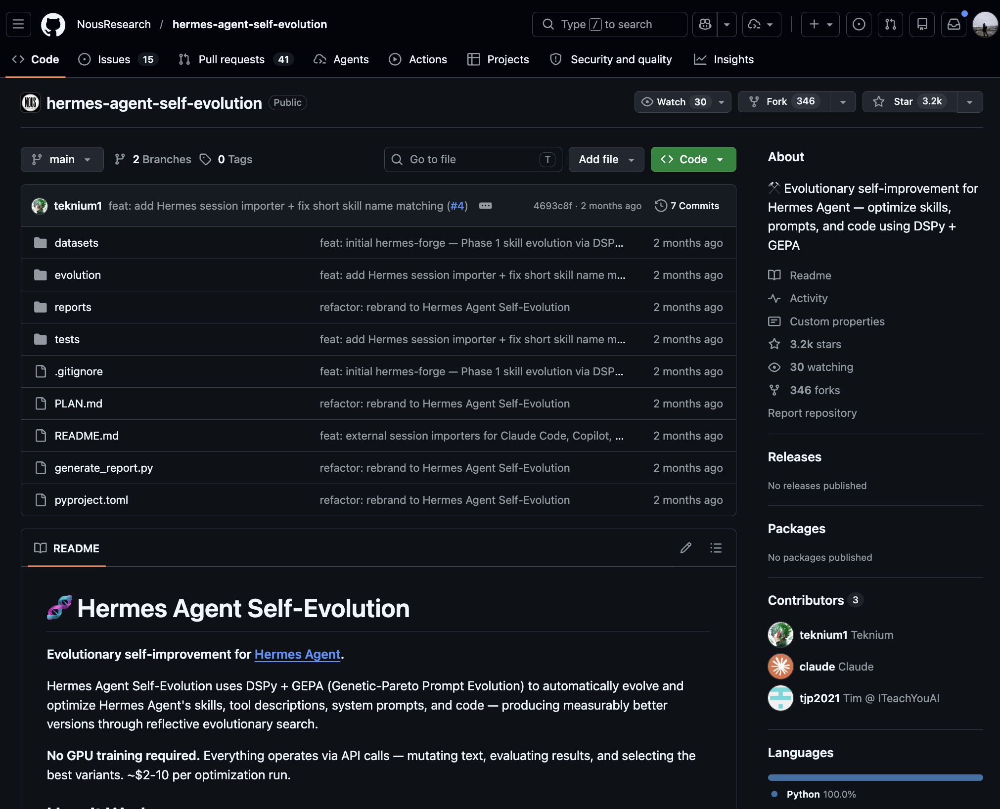
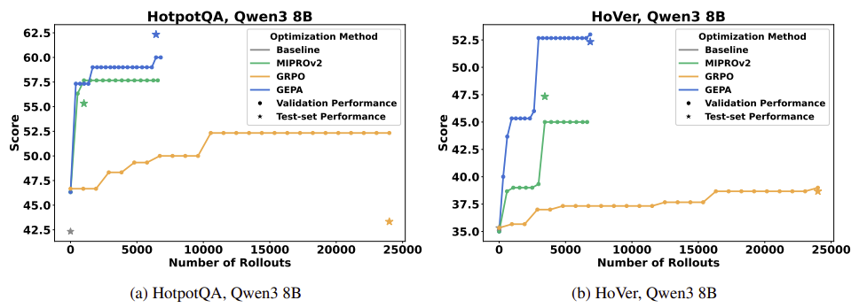

# 목차

- [Hermes Agent](#hermes-agent)
- [Architecture](#architecture)
  - [React + Iteration budget + Tool](#react--iteration-budget--tool)
    - [백그라운드 큐레이터](#백그라운드-큐레이터)
      - [작동 방식](#작동-방식)
      - [적용 대상 및 정보](#적용-대상-및-정보)
    - [메모리](#메모리)
    - [스킬](#스킬)
- [Self-evolution System (DSPy + GEPA)](#self-evolution-system-dspy--gepa)
  - [DSPy (Declarative Self-improving Language Programs, pythonically)](#dspy-declarative-self-improving-language-programs-pythonically)
    - [문제 정의](#문제-정의)
    - [제안 방법](#제안-방법)
      - [Signature: 입출력 선언](#signature-입출력-선언)
      - [Module: 재사용 가능한 LM 호출 패턴](#module-재사용-가능한-lm-호출-패턴)
      - [Teleprompter (Optimizer): 자동 최적화](#teleprompter-optimizer-자동-최적화)
      - [핵심 철학 : 분리](#핵심-철학--분리)
    - [시사점 (영향)](#시사점-영향)
  - [GEPA (Genetic-Pareto)](#gepa)
    - [문제 정의](#문제-정의-1)
    - [접근 방식](#접근-방식)
    - [세부 적용 기술](#세부-적용-기술)
- [Reference](#reference)

# Hermes Agent



- Opensource AI group, LLM 기업 Nous Research가 발표한 모델 
  - 2024년 8월, Hermes 3 AI 
  - 2025년 8월, Hermes 4 AI

- 터미널에서 `hermes`를 입력하면 대화가 시작되고, 파일을 읽고 쓰고, 웹을 검색하고, 명령을 실행하고, 메시지를 보내는 등 다양한 작업을 수행

- 메모리와 스킬로 사용할수록 똑똑해지는 "성장하는 에이전트"는 OpenClaw를 비롯해 이 분야의 공통 흐름

- Hermes Agent도 같은 방향이지만, 복잡한 작업이 끝난 뒤 `백그라운드에서 대화를 리뷰하고 스스로 스킬을 생성하는 자동화 메커니즘`에 더해, `백그라운드 큐레이터가 7일 주기로 라이브러리 전체를 정리해 주는 단계까지 와 있는 것`이 특징
- `Self-evolution System`을 갖춰 세대를 업그레이드

- 특징 (대부분 Openclaw와 같은 Autonomous AI Agent와 유사) 
  - 폐쇄형 학습 루프
  - 강력한 터미널 및 멀티 플랫폼 인터페이스
  - 모델 불가지론적 아키텍처 : 특정 벤더의 API에 종속되지 않음 (z.ai/GLM, OpenRouter, Nous Portal, kimi 등 어떤 모델이든 사용 가능)
  - 다양한 실행 백엔드 및 서버리스 영속성 지원 : Docker, SSH, Daytona 등 터미널 백엔드 지원
  - 하위 에이전트 위임 및 병렬 처리
  - 자동화 스케쥴러 내장
  - 확장성 및 연구자 친화적 환경 : MCP, Tool-calling model,등




# Architecture

## React + Iteration budget + Tool
- 내부는 Monolithic이 아닌 느슨하게 결합된 sub-system으로 구성.
- ReAct Loop 구성

    ```
    run_conversation(user_message)
    1. 이터레이션 버짓 초기화 (IterationBudget)
    2. 대화 히스토리 준비, todo 상태 복원
    3. 시스템 프롬프트 빌드 또는 캐시에서 로드
    4. 프리플라이트 압축 (필요시)
    5. while 루프 진입:
        a. 인터럽트 체크
        b. 이터레이션 버짓 소비
        c. API 메시지 조립 (에페메럴 레이어 주입)
        d. 프롬프트 캐싱 적용
        e. 고아 도구 페어 정리 (sanitize)
        f. API 호출 (스트리밍 또는 비스트리밍)
        g. 도구 호출이 있으면 → 실행 후 루프 계속
        h. 최종 텍스트면 → 세션 저장, 결과 반환
    ```

- Iteration Budget
  - 부모 에이전트와 서브 에이전트가 공유 이터레이션 버짓을 사용. 아래 클래스가 스레드 안전한 카운터 제공
  ```
  # 소스 코드 (run_agent.py)에서 확인한 구조
  class IterationBudget:
      def __init__(self, max_total: int):  # 기본값 90
          self.max_total = max_total
          self._used = 0
          self._lock = threading.Lock()

      def consume(self) -> bool:  # 1회 소비, 초과 시 False
      def refund(self) -> None:   # execute_code 턴은 환불
  ```
- Tool
  - 순차실행 : 단일 도구 호출이거나 interactive tool이 포함되는 경우
  - 병렬 실행 : 여러 도구가 동시에 요청되고 안ㅇ전 조건을 만족되는 경우 (_MAX_TOOL_WORKER : 8)
  

- Hermes가 사용하는 LLM API는 모두 Stateless(무상태)
- 서버는 이전 대화를 기억하지 않고, Hermes Agent는 매 API를 호출할때마다 다음을 모두 전송 (이 구조가 토큰 오버헤드를 발생함)
  1. 시스템 프롬프트 : 에이전트 정체성, 메모리, 스킬 인덱스, 컨텍스트 파일 등 (바로 아래 표로 설명)
  2. 도구 정의 : 등록된 모든 도구의 이름, 설명, 파라미터 스키마
  3. 대화 이력 전체 : 첫 턴부터 현재까지의 모든 메시지
  - 도구 29개와 스킬 116개가 등록된 상태에서 단순한 질문 하나에도 약 14,000토큰이 소비
  - 턴이 쌓일수록 대화 이력도 함께 재전송되므로 토큰 소비는 가속
  - hermes뿐만 아니라 Stateless 기반 LLM API를 사용하는 모든 에이전트의 공통특성
- 캐시된 프롬프트

    |순서|레이어|설명|
    |------|---|---|
    |1|	에이전트 아이덴티티	| SOUL.md 우선, 없으면 DEFAULT_AGENT_IDENTITY|
    |2|	도구 기반 행동 가이던스	|memory, session_search, skills 도구가 로드된 경우에만|
    |3|	Honcho 블록	|Honcho 활성화 시 (recall 모드에 따라 내용 변경)|
    |4|	시스템 메시지	|gateway/사용자가 제공한 경우|
    |5|	메모리 스냅숏|	MEMORY.md (고정 스냅숏)|
    |6|	유저 프로필|	USER.md (고정 스냅숏)|
    |7|	스킬 인덱스	|사용 가능한 스킬 목록|
    |8|	컨텍스트 파일|	AGENTS.md, .cursorrules, .hermes.md|
    |9|	타임스탬프 + 모델 정보|	대화 시작 시점 고정|
    |10|	플랫폼 힌트	|cli, telegram, discord 등에 따른 포맷 가이드|

- 세션 영속화 : SQLite 기반 상태를 저장 (`~/.germes/state.db`로 JSONL 형태가 아님)
- 서브에이전트 위임

### 백그라운드 큐레이터
- 스킬 라이브러리, Memory등은 시간이 지날수록 늘어남 -> 자동 생성된 스킬, 한번 쓰고 잊은 스킬, 비슷한 작업 등으로 점점 내용이 많아짐
- 이 문제를 해결하기 위해 도입되어, Curator(큐레이터)는 Hermes Agent 내의 각종 데이터를 자동으로 정리하는 Background Agent
- 일정 주기(7일) gateway cron ticker 위에서 한번씩 깨어나 데이터의 등급을 매기고 합치고 치우는 bakcgroudn review pass

#### 작동 방식
1. 1단계 - 휴리스틱 (w/o LLM call)

    |상태|의미|
    |---|---|
    |active|최근에 쓰인 스킬|
    |stale|stale_after_days 동안 안 쓰인 스킬 (기본 30일)|
    |archived|archive_after_days 동안 안 쓰인 스킬 (기본 60일). `~/.hermes/skills/.archive/`로 이동|

    - pin된 스킬은 이 자동 전이를 받지 않습니다.

2. 2단계 - LLM Reivew pass
  - 비슷한 스킬을 consolidated(합칠지) 
  - 살아있어도 가치가 낮은 스킬을 pruned(솎아낼지)
  - 살릴 만한 활성 스킬에는 사용 흔적을 바녕ㅇ해 가벼운 정리

#### 적용 대상 및 정보
- memory, skills 도구셋에만 활성화되며, 나머지는 건드리지 않음.
- 수행 후 보고서를 만들어서, 롤백이 가능하도록 조치
- 8일의 기본 주기, idle 가드로 최근까지 도구가 활발이 호출되었다면 Curator 동작을 미룸
- 자동 백업

### 메모리
- memory.md
  - 용량: 최대 2,200자 (약 800 토큰)
  - 에이전트가 스스로 관리하는 메모 파일입니다. 다음과 같은 내용이 저장됩니다.
    - 환경 정보 (OS 버전, 설치된 도구 등)
    - 프로젝트 규칙과 관례
    - 과거에 배운 교훈
    - 문제 해결 방법 (workaround)

    ```
    ## 환경
    - macOS Big Sur 11.7, Intel Mac
    - Ollama 서버: LAN 내 별도 머신
    - 사용 모델: qwen2.5:14b-instruct-q5_K_M

    ## 규칙
    - Python 파일은 항상 type hints 사용
    - 커밋 메시지는 한국어로 작성

    ## 교훈
    - llama3.1:8b는 복잡한 도구 체인에서 실수가 잦음 → 14B 모델 사용 권장
    ```

- user.md
  - 용량: 최대 1,375자 (약 500 토큰)
  - 사용자에 대한 프로필 정보입니다.
    - 이름과 역할
    - 타임존
    - 선호하는 작업 방식
    - 전문 분야
    - 커뮤니케이션 스타일

    ```
    ## 프로필
    - 이름: Yong
    - 역할: IT 서적 저자/번역가
    - 위치: 한국 (KST)

    ## 선호
    - 응답 언어: 한국어
    - 코드 주석: 한국어
    - 설명 스타일: 실습 중심, 간결하게
    ```

- 메모리의 작동 방식 / 용량관리
    - 메모리는 세션 시작 시 시스템 프롬프트에 주입
    - 중복은 자동으로 거부, 80% 이상일때 consolidate(정리) 기능, 정리는 Agent의 판단 하에 진행
    - 백그라운드 리뷰 시스템이 적용되어있어 memory 도구를 일정대화동안 호출하지 않으면 백그라운드로 리뷰 에이전트가 메모리 저장여부를 판단하여 업데이트

### 스킬
1. 에이전트가 대화 중 도구를 반복적으로 호출
2. 도구 호출이 일정 횟수가 누적되면 리뷰 플래그 활성
3. 에이전트가 사용자에게 응답을 완료한 후, 별도의 백그라운드 스레드에서 리뷰 에이전트 실행
4. 리뷰 에이전트는 대화 내용을 검토하고, 재사용 가능한 워크 플로우가 있는 경우 `skill_manage` 도구로 스킬 생성

# Self-evolution System (DSPy + GEPA)

- https://github.com/NousResearch/hermes-agent-self-evolution

- 이 별도 시스템은 DSPy + GEPA(Genetic-Pareto Prompt Evolution)를 사용하여 에이전트의 구성요소를 자동으로 최적화 함
- Hermes Agent의 자기 진화 시스템은 이 GEPA 논문의 기법을 활용하는 관계
- NousResearch가 GEPA를 만든 것이 아니라, 학회에서 검증된 외부 기법을 에이전트 최적화에 적용한 것

- 최적화 대상
    - 스킬: 더 효과적인 절차로 진화
    - 도구 설명: LLM이 도구를 더 정확하게 선택하도록 설명 개선
    - 시스템 프롬프트: 더 효과적인 프롬프트로 진화
    - 코드: 에이전트의 코드 자체를 개선
- 작동 방식
    1. 현재 스킬/프롬프트/코드의 성능을 측정
    2. 변형(mutation)을 생성
    3. 각 변형의 성능을 평가
    4. 파레토 최적(Pareto optimal) 변형을 선택
    5. 다음 세대로 진행

    ```
    Read current skill/prompt/tool ──► Generate eval dataset
                                            │
                                            ▼
                                    GEPA Optimizer ◄── Execution traces
                                            │                    ▲
                                            ▼                    │
                                    Candidate variants ──► Evaluate
                                            │
                                    Constraint gates (tests, size limits, benchmarks)
                                            │
                                            ▼
                                    Best variant ──► PR against hermes-agent
    ```


## DSPy (Declarative Self-improving Language Programs, pythonically)
- https://arxiv.org/abs/2310.03714
- https://github.com/stanfordnlp/dspy


<"프롬프트를 쓰지 마라. 프로그램을 짜라.", AlixPartners의 기술 컨설턴트 Kevin Madura가 AI Engineer 컨퍼런스에서 발표>

- DSPy: Compiling Declarative Language Model Calls into Self-Improving Pipelines (The Twelfth International Conference on Learning Representations Journal, 2024)

- DSPy를 단순한 라이브러리 소개가 아니라 LLM 애플리케이션을 구축하는 패러다임 자체의 전환으로 제시

- 파이썬 스타일로 작성된 선언적이고 스스로 개선되는 기능을 갖춘 자연어 처리 프로그램을 의미

- 이 프레임워크에서는 LLM 파이프라인이 무엇을 할 것인지를 명확히 선언하면, 내부적으로 스스로 학습하고 최적화하여 성능을 향상시키는 기능이 있음

- AlixPartners의 기술 컨설턴트 Kevin Madura가 AI Engineer 컨퍼런스에서 발표한 세션

### 문제 정의

- 현재 LLM Application 개발 문제    

```
전형적인 RAG 파이프라인의 프롬프트:

"You are a helpful assistant. Given the context below, answer the question.
 Be concise. If you don't know, say 'I don't know'.
 Context: {context}
 Question: {question}
 Answer:"


문제점:

1. 취약성: 단어 하나 바꾸면 성능 급변 ("Be concise" 제거 → 성능 10% 하락)
2. 모델 종속: GPT-4에서 튜닝한 프롬프트가 Llama에서는 작동 안 함
3. 파이프라인 복잡도: RAG = 검색 + 재랭킹 + 생성, 각 단계마다 프롬프트 튜닝 필요
4. 비체계적: 프롬프트 변경의 전체 파이프라인 영향을 예측 불가
```

→ 핵심 제안: 프롬프트를 직접 쓰는 대신, 무엇을 할지(what)를 선언하고 어떻게 할지(how)는 컴파일러에 맡긴다.

### 제안 방법

#### Signature: 입출력 선언
- 장황하게 프롬프트를 문장으로 직접 쓰는게 아닌, `관련 문맥이 들어오고, 질문이 들어오면, 짧은 대답을 내야한다`의 작업 계약 선언

```python
# 기존: 장황한 프롬프트 직접 작성
prompt = "Given a question, search for relevant passages and provide a concise answer..."

# DSPy: 입출력만 선언
class GenerateAnswer(dspy.Signature):
    """Answer questions with short factoid answers."""
    context = dspy.InputField(desc="relevant passages")
    question = dspy.InputField()
    answer = dspy.OutputField(desc="often between 1 and 5 words")
```

#### Module: 재사용 가능한 LM 호출 패턴
- Signature가 `무엇을 입력받고 무엇을 출력할지`를 정의한다면, Module에서는 실제 파이프라인에서 어떻게 설정할지를 구성

```python
# 내장 모듈
dspy.Predict(signature)      # 기본 LM 호출
dspy.ChainOfThought(sig)     # 자동으로 "reasoning" 단계 추가
dspy.ReAct(sig, tools=[...]) # ReAct 패턴 자동 구현
dspy.Retrieve(k=3)           # 검색 모듈

# RAG 파이프라인 정의
class RAG(dspy.Module):
    def __init__(self):
        self.retrieve = dspy.Retrieve(k=3)
        self.generate = dspy.ChainOfThought(GenerateAnswer)

    def forward(self, question):
        context = self.retrieve(question).passages
        return self.generate(context=context, question=question)
```

#### Teleprompter (Optimizer): 자동 최적화
- DSPy에서 자동 최적화를 하는 담당하는 부분으로, 학습 데이터와 평가 메트릭을 주면 Teleprompter가 여러 후보를 만들어내고 성능 좋은 조합을 찾음

```
컴파일 과정:

1. 학습 데이터 (질문, 정답) 쌍 준비
2. Teleprompter가 자동으로:
   - Few-shot 예시 선택 (BootstrapFewShot)
   - 또는 instruction 최적화 (COPRO, MIPRO)
   - 또는 파인튜닝 데이터 생성 (BootstrapFinetune)
3. 각 모듈의 프롬프트를 독립적으로 최적화
4. 전체 파이프라인의 end-to-end 메트릭 기반 평가


teleprompter = BootstrapFewShotWithRandomSearch(
    metric=answer_exact_match,
    max_bootstrapped_demos=4,
    num_candidate_programs=16
)
compiled_rag = teleprompter.compile(RAG(), trainset=trainset)
```

#### 핵심 철학 : 분리

```text
개발자가 정의하는 것:     컴파일러가 결정하는 것:
  - 입출력 스키마          - 프롬프트 텍스트
  - 모듈 구조              - Few-shot 예시 선택
  - 평가 메트릭            - Instruction 문구
  - 파이프라인 흐름         - 파인튜닝 여부/데이터

→ "무엇(what)"과 "어떻게(how)"의 분리
→ 모델을 바꿔도 re-compile만 하면 됨
```

### 시사점 (영향)

- "프롬프트 엔지니어링 → 프롬프트 프로그래밍" 패러다임 전환의 선두주자
- LLM 애플리케이션을 소프트웨어 공학적으로 다루는 프레임워크 — 테스트, 최적화, 재현 가능
- 모델 독립적 개발: 코드 변경 없이 GPT-4 → Llama → Mistral 전환 가능
- Stanford NLP 그룹(ColBERT, Alpaca의 저자들)의 집대성
- LangChain/LlamaIndex와 다른 철학: 체이닝(how) 대신 선언(what)에 집중

## GEPA (Genetic-Pareto)

- GEPA: Reflective Prompt Evolution Can Outperform Reinforcement Learning (ICLR 2026 Oral)
- https://arxiv.org/abs/2507.19457
- 독립적인 프롬프트 최적화 기법
- https://github.com/gepa-ai/gepa
- GEPA가 GRPO(Group Relative Policy optimization, DeepseekMath paper) 대비 평균 6%(최대 20%) 높은 성능을 35배 적은 롤아웃으로 달성
  - DeepSeekMath: Pushing the Limits of Mathematical Reasoning in Open Language Models 2024'
- 에이전트의 실행 궤적(추론, 도구 호출, 도구 출력)을 자연어로 반성(reflect)하여 프롬프트 개선점을 진단하는 방식
    - 프롬프트 최적화(prompt optimization)
    - GEPA(Genetic-Pareto)는 이 과정에 '자연어로 되돌아보기(Reflective language feedback)'를 도입
    - `AI가 스스로 행동을 되돌아보고, 어떤 점이 좋았고 부족했는지를 자연어로 분석해, 다음 프롬프트를 개선하는 방식`



### 문제 정의
- 기존에는 LLM을 특정 작업에 맞게 최적화하기 위해 RL 방식이 주로 사용
- 하지만 아래와 같은 한계 발생 
  - 샘플 비효율성 : 새로운 작업을 하려면 `수만 번의 시도`가 필요
  - 고비용 : 각 시도는 고성능 모델 호출, 외부 도구 실행 등으로 인해 `시간과 비용`이 많이 듬
  - 해석 불가 : 보상 신호가 숫자로 주어지기 때문에, `모델이 왜 실패했는지 알기 어려움`


### 접근 방식
1. 자연어 반성 기반 프롬프트 진화 : 모델의 실행 기록을 분석하고, `이를 자연어로 Reflection 해보고 문제점`을 진단
2. 유전 알고리즘 기반 프롬프트 변화 : 좋은 프롬프트 기반으로 `다양하게 Mutation` 하면서 점차 향상된 프롬프트 생성
3. Pareto 기반 후보 선택 : 모든 테스트에서 평균적으로 좋은 프롬프트만 선택하는게 아니라, 특정 테스트에서 최고 성과를 낸 다양한 프롬프트를 유지하면서 `균형있게 최적화`

> Reflection이란? reflection은 단순히 실행 결과를 보고 성공/실패를 판단하는 것이 아니라 다음과 같은 과정을 진행
>  - Reflexion: Language Agents with Verbal Reinforcement Learning : https://arxiv.org/abs/2303.11366
> 
> Pareto : '하나를 개선하면 다른 것이 나빠지지 않아야 한다'는 다목적 최적화(Multi-objective optimization) 개념
>   - Pareto Optimal : 여러 목표 (예: 성능, 비용, 효율성 등)을 동시에 고려해야 할 때, 어떤 해결책이 다른 해결책보다 전반적으로 더 우수한 경우
> * 한 분야에서는 좀 뒤쳐질 수도 있지만 전략적 우수성 때문에 진화 과정에서 훨씬 더 앞서나갈 수 있는 것이 존재할 수 있다는 얘기로, 이런 것들을 좀 더 보존하면서 진행해야 함
>   - Pareto Principle : 전체 결과 80%가 전체 원인의 20%에서 비롯된다. 80:20 법칙

### 세부 적용 기술
- Reflective Prompt
- Pareto-based Candidate Selection
- System-aware Merge
- Sample efficiency


## Hermes Agent Self-Evolution이 진화시키는 영역과 엔진
- No GPU training required. Everything operates via API calls — mutating text, evaluating results, and selecting the best variants. ~$2-10 per optimization run.


|페이즈| 진화 대상|	엔진	|상태|
|---|---|---|---|
|Phase 1|	스킬 파일(SKILL.md)	|DSPy + GEPA	|✅ Implemented
|Phase 2|	도구 설명(Tool Description)	|DSPy + GEPA	|🔲 Planned
|Phase 3|	시스템 프롬프트 섹션|	DSPy + GEPA	|🔲 Planned
|Phase 4|	도구 구현 코드	|Darwinian Evolver|	🔲 Planned
|Phase 5|	지속적 개선 루프	|자동화 파이프라인	|🔲 Planned

## Hermes Agent Self-Evolution의 가드레일 정책
- 의도치 않은 회귀(Regression)나 비대칭한 동작 변경이 발생할 위험이 큼. 이를 막기 위해 Hermes Agent Self-Evolution에서 5가지 가드레일 명시

1. Full test suite — pytest tests/ -q must pass 100%
2. Size limits — Skills ≤15KB, tool descriptions ≤500 chars
3. Caching compatibility — No mid-conversation changes
4. Semantic preservation — Must not drift from original purpose
5. PR review — All changes go through human review, never direct commit

## 시사점
- 이 시스템의 존재는 Hermes Agent가 단순한 엔지니어링 프로젝트가 아니라, 연구 기반의 프레임워크임
- RL 학습 파이프라인(Atropos)을 자체 구축하고, 학회에서 검증된 외부 기법(GEPA)을 프롬프트 최적화에 적용하는 등 여러 방향의 자기 개선을 시도

# Reference

https://github.com/stanfordnlp/dspy

https://wikidocs.net/329463 

https://devocean.sk.com/blog/techBoardDetail.do?ID=166043&boardType=techBlog 

https://wikidocs.net/329463 

https://wikidocs.net/334966 

https://github.com/stanfordnlp/dspy 

https://velog.io/@smj230/%EB%85%BC%EB%AC%B8-%EB%A6%AC%EB%B7%B0-DSPy-Compiling-Declarative-Language-Model-Calls-into-Self-Improving-Pipelines

https://discuss.pytorch.kr/t/hermes-agent-nousresearch-ai/9184 

https://discuss.pytorch.kr/t/hermes-agent-self-evolution-hermes-agent-nousresearch/10136 

https://wikidocs.net/334920
